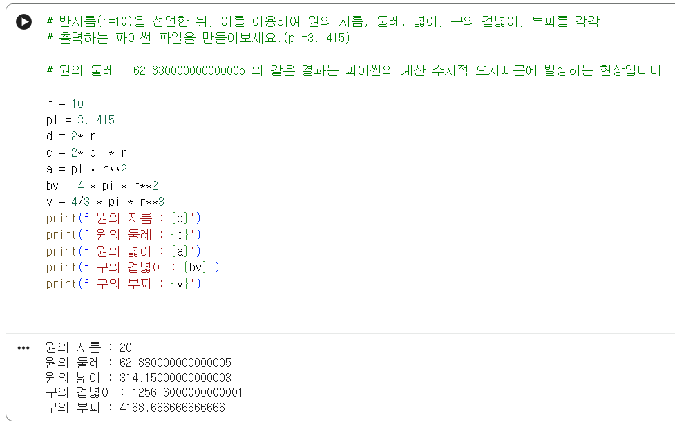

# Python 기초 강의
- 강사 : 최우영
## 1. 연산자
## 2. 변수
> Computational Thinking
- 정답이 정해지지 않은 어떤 문제를 일반화하는 과정
- 문제상황 : 배가 고프다 -> (변수)을 먹는 행위로 배고픔을 해소
- 변수를 결정하는 다양한 파라미터
  - 날씨
  - 비가올 때 -> 전
  - 화창할 때 -> 냉면
  - 추울 때 -> 콩국수
  - 어제 안 먹은거
  - 시간
  - 건강
  - 기분 등등

> 예제

## 3. Import Python Enhance Proposal
### - _ : ignore, 이미 할당되어 있는 공간, 변수생성 필요없음 
> Naming Convention
- PascalCase : 클래스 이름
- snake_case : 함수, 변수, 메소드 이름
> Syntax
> operators
> 