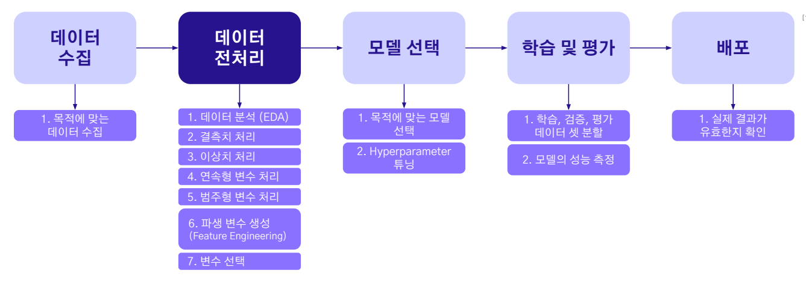
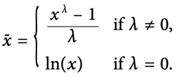
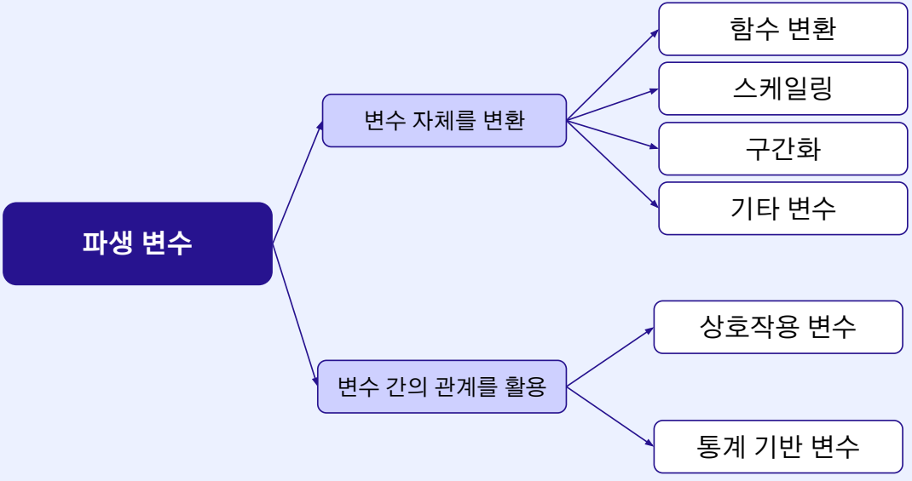

# AI 부트캠프 ML Advanced
- 김현우 Upstage

## Machine Learning Advanced

### OT
> 강의 목표
- 데이터 전처리 -> 모델 선택 -> 학습 및 평가
- 데이터 수집, 배포는 제외
- 머신러닝 전체 파이프라인 체계적 이해 및 실습
- 실무 및 대회에서의 전략적 접근법 습득
- 주로 쓰이는 3가지 모델
  - XGBoost, LightGBM, CatBoost
  - LightGBM 중요

### Ch01-01_데이터 전처리 (이론)
> 데이터 전처리의 중요성
- 선형회귀 모델 및 KNN(거리기반 알고리즘) 결측치 및 이상치에 영향
> 데이터의 종류
- 정형(Tabular) 데이터
- 비정형(Unstructured) 데이터
> 변수
- 수치형 변수
  - 연속형 변수
  - 이산형 변수
- 범주형 변수
  - 명목형 변수
  - 순위형 변수
> 결측치 다루기
- 매커니즘
  - 완전 무작위 결측(MCAR: Missing Completely At Random) : 완전
  - 무작위 결측(MAR:Missing At Random) : 다른 변수와 연관
  - 비무작위 결측(MNAR:Missing Not At Random) 자기 자신과 연관
- 패턴
  - 일변량 결측 패턴(Univariate Pattern) : 하나의 변수에서만 발생
  - 단조 결측 패턴(Monotone Pattern) : 일정하고 단조적인 패턴으로 발생
  - 일반 결측 패턴(General & Non-Monotone Pattern)
  - 규칙 결측 패턴(Planned Pattern) : 일정한 패턴 및 규칙에 따라 발생
- 처리
  - 삭제
    - 목록(Listwise) 삭제
    - 열 삭제
  - 대체(Imputation)
    - 통계값(평균값, 최빈값, 중앙값) 으로 대체
    - 특이한 대체값 : 경진대회에서 높은 점수를 받을 수 있음
      - 회귀 대체(Regression) : 변수 간의 연관성을 활용, 실제 데이터와의 유사 가능성 높음
  - 결측치 처리 방안
    - 10% 미만 : 제거, 대체
    - 10~20% : 회귀 대체, Hot Deck
    - 20% 이상 : 회귀 대체
> 이상치 다루기
- 이상치란 : 일반적인 데이터 패턴을 벗어나는 관측치
- 이상치가 나타나는 다양한 원인
  - 편법이나 조작 : 주식 작전세력, 부동산 업&다운 거래, 분양가 상한제
  - 휴먼 에러
  - 데이터 전송 오류, 위변조 해킹, 수집 기기의 오작동
- 이상치 탐지 및 제거가 필요한 이유
- 이상치(outlier) 종류
  - 점 이상치(Point, Global outlier)
  - 상황적 이상치(Contextual Outlier)
  - 집단적 이상치(Collective outlier) : 스팸메일
- 이상치 탐지 
  - Z-Score
  - IQR(Inter Quartile Range)
    - Q1 - 1.5*IQR , Q3 + 1.5*IQR
- 이상치 처리
  - 삭제
  - 대체
  - 변환 : log 사용

### Ch01-02_카테고리와 기타 변수 다루기 (이론)
> 01 연속형 변수 다루기 : 데이터 클리닝 및 파생 변수로 변환
- 1.1 함수 변환
  - 로그 변환(*)
    - 비대칭(Right-Skewed)된 임의의 분포를 정규분포에 가깝게 전환
    - 모델(회귀)의 성능 향상
    - 데이터간의 편차 줄이는 효과
    - 변환 특징 : 비대칭이 완화, 이상치 완화, 0음수는 적용 불가능
  - 제곱근 변환
    - 로그변환고 유사
    - 특징 : 축소에 대한 강도
    - 비대칭이 강한 경우 로그, 약한 경우 제곱근 변환이 유리
    - 왼쪽으로 치우쳐진 분포는 더 치우치는 부작용 발생
  - Box-Cox변환
    - 람다를 통해 변환
    - 
    - 람다값 조정을 통해
- 1.2 스케일링 : 변수들의 범위를 동일한 수치 범위로 변경, KNN 같은 거리기반 알고리즘에 효과
  - Min-Max 스케일링(*)
    - Min, Max가 이상치일 경우 취약할 수 있다.
  - 표준화(*)
    - 평균 0 표준편차 1 : Z-Score
  - 로버스트 스케일링
    - IQR 기준으로 변환
    - 중앙값 활용으로 이상치에 강건한 효과
- 1.3 구간화
  - 수치형 변수를 범주형 변수로 전환
  - 등간격, 등빈도로 나누어 구간화 진행
  - 이상치 완화
  - 모델 해석이 용이
> 02 범주형 변수 다루기 : 알고리즘 모델이 인식할 수 있는 실수(정수) 형태로 전환해 주는 것이 필요
- 2.1 원-핫 인코딩
  - 0과 1로만 구성된 이진 벡터 형태로 변환하는 방법
  - 벡터의 차원이 늘어나면 메모리 및 연산에 악영향
  - 차원의 저주 발생
- 2.2 레이블 인코딩
  - 정수로 표현, 순서가 존재하는 변수 적용에 효율적
  - 메모리 관리 측면에 효율적
- 2.3 빈도 인코딩
  - 고유 범주의 빈도 값을 인코딩
  - 레이블 인코딩과 같이 사용하여 단점 해결
  - Count Encoding 이라고도 불림
- 2.4 타켓 인코딩
  - 특정 변수를 통계량(평균)으로 인코딩
  - Mean Encoding 이라고도 불림
  - 단점 : 학습과 검증데이터 분할했을 때, 타켓 변수 특성이 학습 데이터셋에서 이미 노출되었기 때문에 Data-Leakage 발생
  - 타켓 인코딩 과적합 방지 : 
    - Smoothing
    - K-Fold(교차 검증)

### Ch01-03_데이터 전처리 (실습)
> [ML Advanced] (1-3) 데이터 전처리.ipynb 파일로 실습

### Ch02-01_파생 변수 만들기 (이론)
> 01 파생 변수란
- 1.1 파생 변수란?
  - 기존 변수의 저오를 토대로 정제 및 생성된 새로운 변수
- 1.2 파생 변수의 종류
  
- 1.3 파생 변수가 중요한 이유
  - 성능적 관점 : 과적합 방지
  - 해석적 관점
  - 메모리 관점
> 02 파생변수 생성1(변수 자체를 변환)
- 2.1 함수 변환
  - 로그변환(Log Trasform) : np.log1p(x) 함수 사용
  - 제곱근 변환
  - Box-Cox 변환
- 2.2 스케일링(Scaling)
  - Min-Max 스케일링
  - 표준화(Standardization)
- 2.3 기타 변수
  - 분할(Split)
  - 시간 변수 : 시간요소를 분리 추출, 시간차를 파생변수로 변환
> 03 파생변수 생성2(변수 간의 관계를 활용)
- 3.1 상호작용 변수
- 3.2 통계 기반 변수
  - 데이터 집계 후 평균, 중앙, 최대, 최소 등 통계치를 파생 변수로 적용
  - 변수 간의 강한 상관관계는 다중공선성 문제를 야기시킬 수 있으므로 적절한 변수 선택이 필요